A flutter package for iOS and Android for applying OpenGL filters to image.

## Usage

### Export processed image

```dart
final texture = await TextureSource.fromAsset('images/demo.jpeg');
final configuration = BrightnessShaderConfiguration();
configuration.brightness = 0.5;
final image = await configuration.export(texture, texture.size);
```

### LookupTable sample

```dart
final texture = await TextureSource.fromAsset('demo.jpeg');
final configuration = LookupTableShaderConfiguration();
configuration.size = 8;
configuration.rows = 8;
configuration.columns = 8;
await configuration.setLutAsset('lookup_amatorka.png');
final image = await configuration.export(texture, texture.size);
```

### LookupTable HALD sample
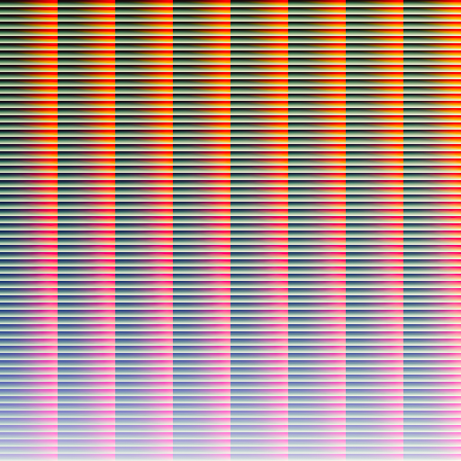
```dart
final texture = await TextureSource.fromAsset('demo.jpeg');
final configuration = LookupTableShaderConfiguration();
configuration.size = 8;
configuration.rows = 64;
configuration.columns = 8;
await configuration.setLutAsset('lookup_hald.png');
final image = await configuration.export(texture, texture.size);
```

### ImageShaderPreview example
```dart
class PreviewPage extends StatefulWidget {
  const PreviewPage({Key? key}) : super(key: key);

  @override
  State<PreviewPage> createState() => _PreviewPageState();
}

class _PreviewPageState extends State<PreviewPage> {
  late TextureSource texture;
  late BrightnessShaderConfiguration configuration;
  bool textureLoaded = false;

  @override
  void initState() {
    super.initState();
    configuration = BrightnessShaderConfiguration();
    configuration.brightness = 0.5;
    TextureSource.fromAsset('demo.jpeg')
        .then((value) => texture = value)
        .whenComplete(
          () => setState(() {
            textureLoaded = true;
          }),
        );
  }

  @override
  Widget build(BuildContext context) {
    return textureLoaded
        ? ImageShaderPreview(
            texture: texture,
            configuration: configuration,
          )
        : const Offstage();
  }
}
```

### Divided preview sample
```dart
class PreviewPage extends StatefulWidget {
  const PreviewPage({Key? key}) : super(key: key);

  @override
  State<PreviewPage> createState() => _PreviewPageState();
}

class _PreviewPageState extends State<PreviewPage> {
  late TextureSource texture;
  late BrightnessShaderConfiguration configuration;
  bool textureLoaded = false;

  @override
  void initState() {
    super.initState();
    configuration = BrightnessShaderConfiguration();
    configuration.brightness = 0.5;
    TextureSource.fromAsset('demo.jpeg')
        .then((value) => texture = value)
        .whenComplete(
          () => setState(() {
            textureLoaded = true;
          }),
        );
  }

  @override
  Widget build(BuildContext context) {
    return textureLoaded
        ? BeforeAfter(
            thumbRadius: 0.0,
            thumbColor: Colors.transparent,
            beforeImage: ImageShaderPreview(
              texture: texture,
              configuration: NoneShaderConfiguration(),
            ),
            afterImage: ImageShaderPreview(
              texture: texture,
              configuration: configuration,
            ),
          )
        : const Offstage();
  }
}
```

## Additional information

### Support status of [GPUImage for iOS](https://github.com/BradLarson/GPUImage2) and [GPUImage for Android](https://github.com/cats-oss/android-gpuimage) shaders

- [x] Brightness
- [x] Bulge Distortion
- [x] CGA Colorspace
- [x] Color Invert
- [x] Color Matrix
- [x] Contrast
- [x] Crosshatch
- [x] Exposure
- [x] False Color
- [x] Gamma
- [x] Grayscale
- [x] Halftone
- [x] Highlight Shadow
- [x] Hue
- [x] Lookup Table
- [x] Luminance
- [x] Luminance Threshold
- [x] Monochrome
- [x] Opacity
- [x] Pixelation
- [x] Posterize
- [x] RGB
- [x] Saturation
- [x] Solarize
- [x] Swirl
- [x] Vibrance
- [x] Vignette
- [x] White Balance
- [x] Zoom Blur

### Sample results


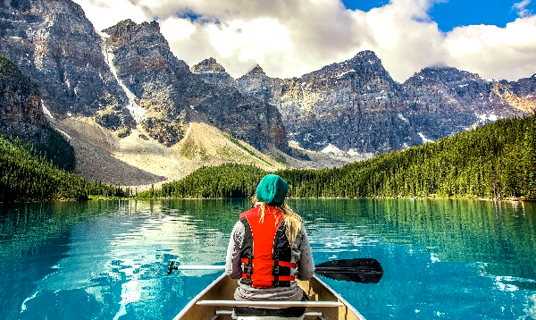
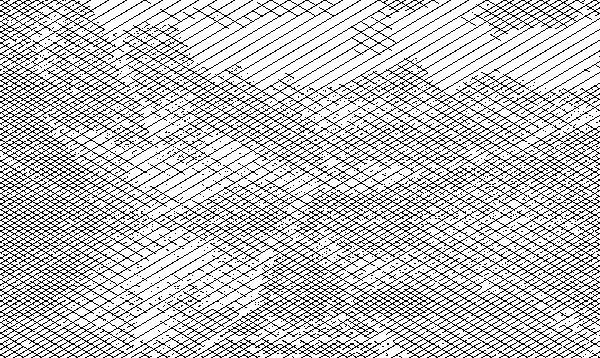
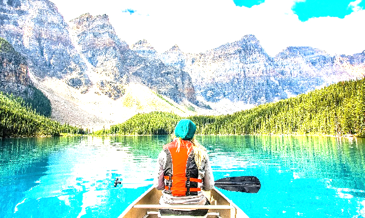

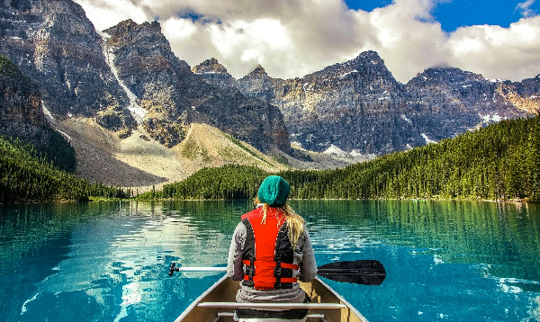
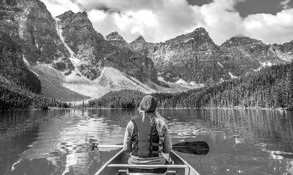
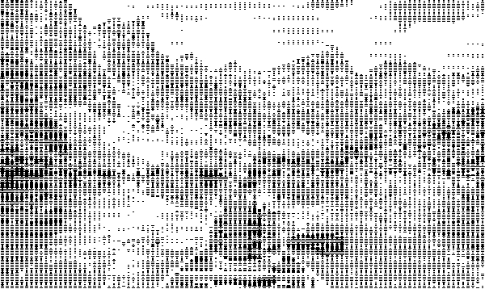

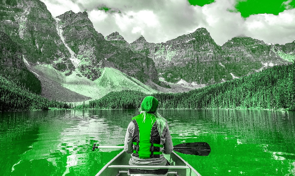


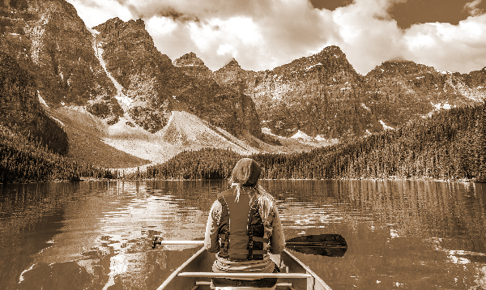


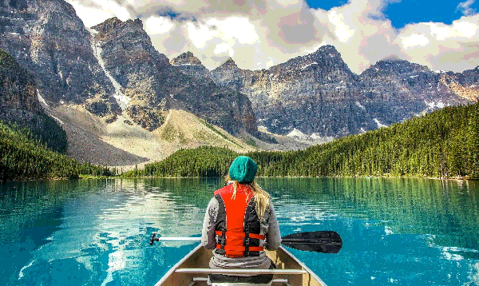
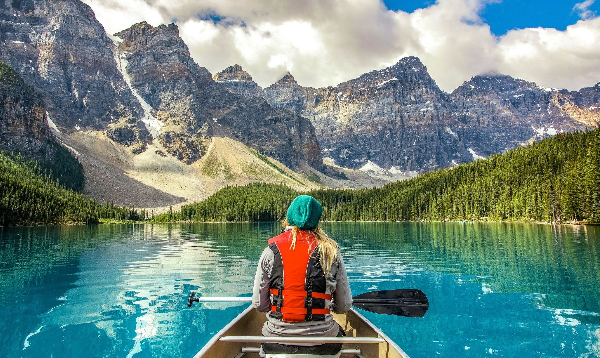

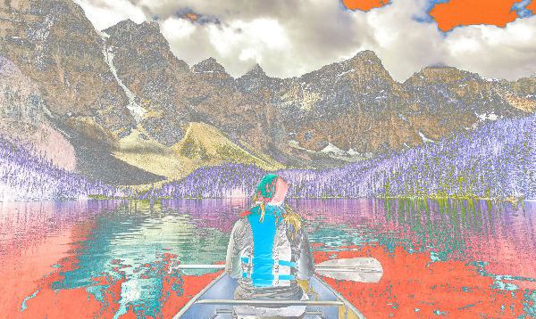
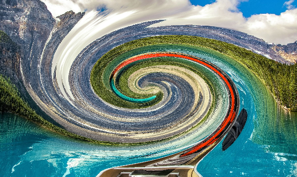

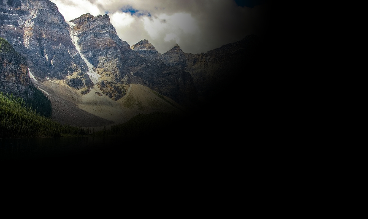


## Examples

- [Big Flutter Filters Demo](https://github.com/nikolaydymura/image_filters_example) - big example of how to use filters and.

## Maintainers

- [Nikolay Dymura](https://github.com/nikolaydymura)
- [Egor Terekhov](https://github.com/EgorEko)